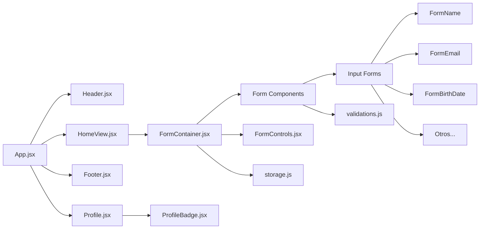

# Lovers Web App

Class project to collect user information for a dating website registration. This application provides a complete user registration flow with profile management and local data storage.

## Technologies
[](https://reactjs.org/)
[](https://vitejs.dev/)
[](https://developer.mozilla.org/docs/Web/JavaScript)
[](https://developer.mozilla.org/docs/Web/CSS)
[](https://www.figma.com)

## Features
- ✅ **Create Account**: Complete multi-step registration form
- ✅ **View Profile**: Display user profile information
- ✅ **Local Storage**: Data persistence using browser's local storage

## Project Structure
```
src/
├── App.jsx                   
├── main.jsx                  
├── index.css                 # Global styles
├── modules/                  
│   ├── Header.jsx            
│   ├── Footer.jsx            
│   ├── HomeView.jsx          
│   ├── ErrorView.jsx         
│   ├── Button.jsx            
│   ├── form/                 # Form components (registration steps)
│   └── profile/              # Profile related components
├── utils/                    
│   ├── validations.js        # Input validators
│   └── storage.js            # localStorage
└── assets/                   
    └── logo_lovers.png
```
## Component Architecture



## How to Try

1. Clone the repository
```bash
git clone https://github.com/SergioGMunoz/Lovers-Web-App.git
```

2. Open the `dist` folder and open the `index.html` file in your browser

## Future Improvements
- **Backend**: Server integration
- **Database**: Database integration
- **Find Partner Screen**: Match discovery functionality
- **Chats Screen**: List of conversations
- **Chat Screen**: Individual chat interface
