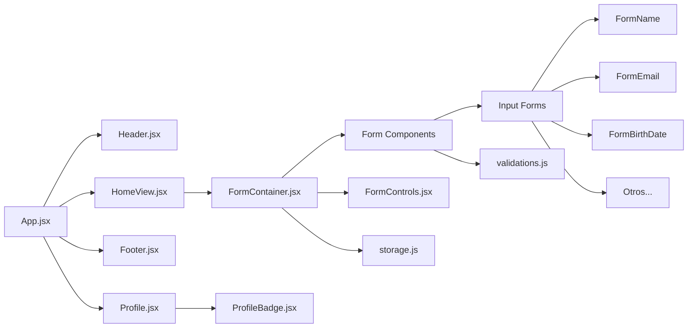

# Lovers Web App

> 🚧 **En desarrollo:** esta aplicación aún no ha sido implementada.  
> El sistema se encuentra en fase de definición y diseño de requisitos.

Proyecto de clase para recopilar información de usuarios para el registro en un sitio web de citas. Esta aplicación proporciona un flujo completo de registro de usuario con gestión de perfil y almacenamiento local de datos.

## ⚙️ Tecnologías
[](https://reactjs.org/)
[](https://vitejs.dev/)
[](https://developer.mozilla.org/docs/Web/JavaScript)
[](https://developer.mozilla.org/docs/Web/CSS)
[](https://www.figma.com)

## 🔧 Funcionalidades
- ✅ **Crear Cuenta**: Formulario de registro completo en múltiples pasos  
- ✅ **Ver Perfil**: Visualización de la información del perfil de usuario  
- ✅ **Almacenamiento Local**: Persistencia de datos usando el almacenamiento local del navegador  


## 🏗️ Project Structure
```
src/
├── App.jsx
├── main.jsx
├── index.css # Estilos globales
├── modules/
│ ├── Header.jsx
│ ├── Footer.jsx
│ ├── HomeView.jsx
│ ├── ErrorView.jsx
│ ├── Button.jsx
│ ├── form/ # Componentes del formulario (pasos del registro)
│ └── profile/ # Componentes relacionados con el perfil
├── utils/
│ ├── validations.js # Validadores de entradas
│ └── storage.js # LocalStorage
└── assets/
└── logo_lovers.png
```

## 🧱 Arquitectura de Componentes


## 🚀 Cómo Probarlo

1. Clona el repositorio
```bash
git clone https://github.com/SergioGMunoz/Lovers-Web-App.git
```

2. Open the `dist` folder and open the `index.html` file in your browser

## 🛩️ Mejoras futuras
- **Backend**: Integración con el servidor
- **Base de Datos**: Integración con la base de datos
- **Pantalla de Buscar Pareja**: Funcionalidad de descubrimiento de coincidencias
- **Pantalla de Chats**: Lista de conversaciones
- **Pantalla de Chat Individual**:Interfaz de chat individual
