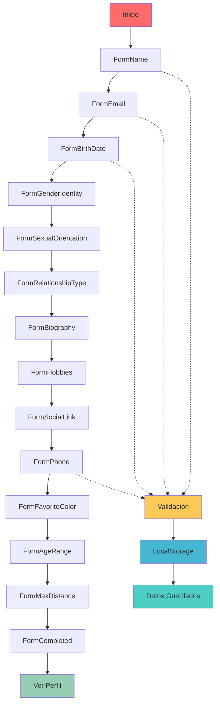
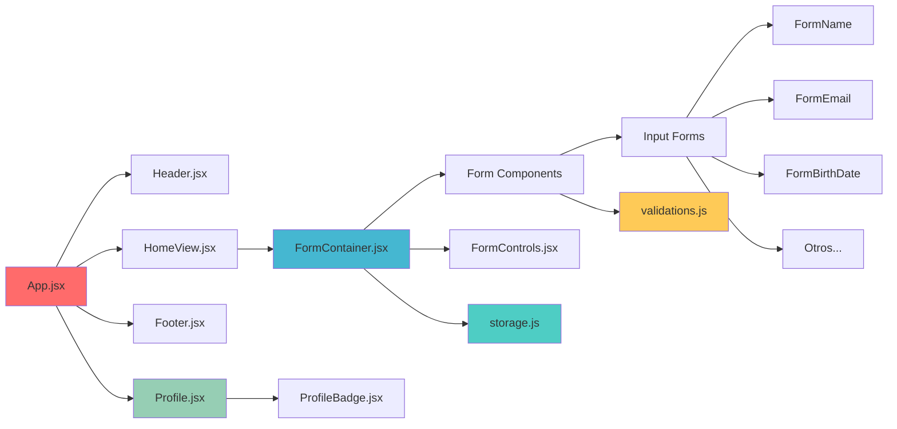
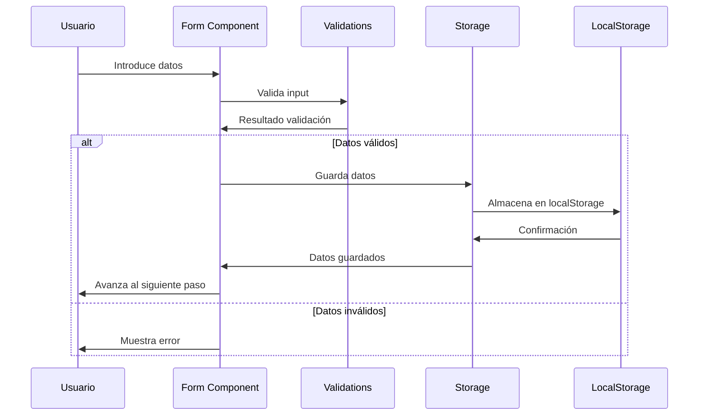
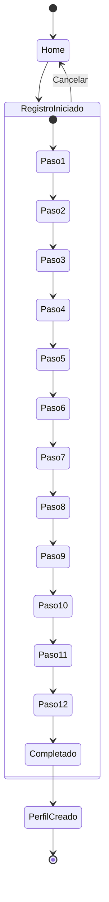
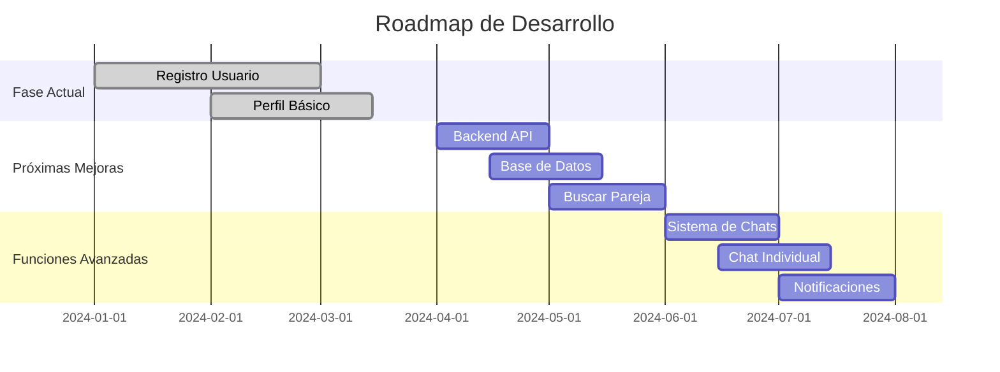
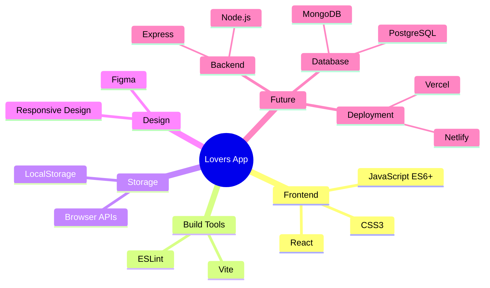
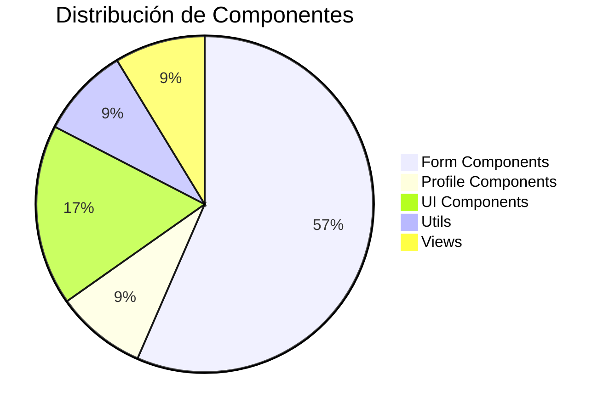

# Lovers Web App - Gráficos y Diagramas

## 🏗️ Estructura del Proyecto

```mermaid
graph TD
    A[Lovers Web App] --> B[src/]
    B --> C[App.jsx]
    B --> D[main.jsx]
    B --> E[modules/]
    B --> F[utils/]
    B --> G[assets/]
    
    E --> H[Header.jsx]
    E --> I[Footer.jsx]
    E --> J[HomeView.jsx]
    E --> K[ErrorView.jsx]
    E --> L[Button.jsx]
    E --> M[form/]
    E --> N[profile/]
    
    M --> O[FormContainer.jsx]
    M --> P[FormName.jsx]
    M --> Q[FormEmail.jsx]
    M --> R[FormBirthDate.jsx]
    M --> S[FormGenderIdentity.jsx]
    M --> T[FormSexualOrientation.jsx]
    M --> U[FormRelationshipType.jsx]
    M --> V[FormBiography.jsx]
    M --> W[FormHobbies.jsx]
    M --> X[FormSocialLink.jsx]
    M --> Y[FormPhone.jsx]
    M --> Z[FormFavoriteColor.jsx]
    M --> AA[FormAgeRange.jsx]
    M --> BB[FormMaxDistance.jsx]
    M --> CC[FormCompleted.jsx]
    M --> DD[FormControls.jsx]
    
    N --> EE[Profile.jsx]
    N --> FF[ProfileBadge.jsx]
    
    F --> GG[storage.js]
    F --> HH[validations.js]
    
    G --> II[logo_lovers.png]
    
    style A fill:#ff6b6b
    style E fill:#4ecdc4
    style M fill:#45b7d1
    style N fill:#96ceb4
    style F fill:#feca57
    style G fill:#ff9ff3
```

## 🔄 Flujo de Registro de Usuario

## 📊 Arquitectura de Componentes

## 💾 Gestión de Datos

## 🎯 Estados de la Aplicación

## 🔮 Roadmap Futuro

## 🛠️ Stack Tecnológico

## 📈 Métricas del Proyecto

